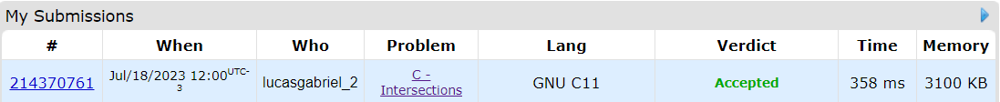
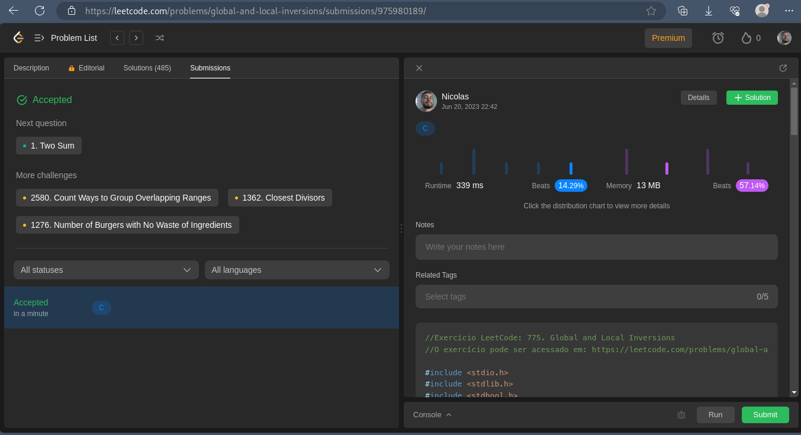
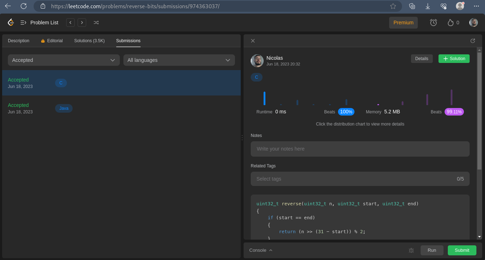
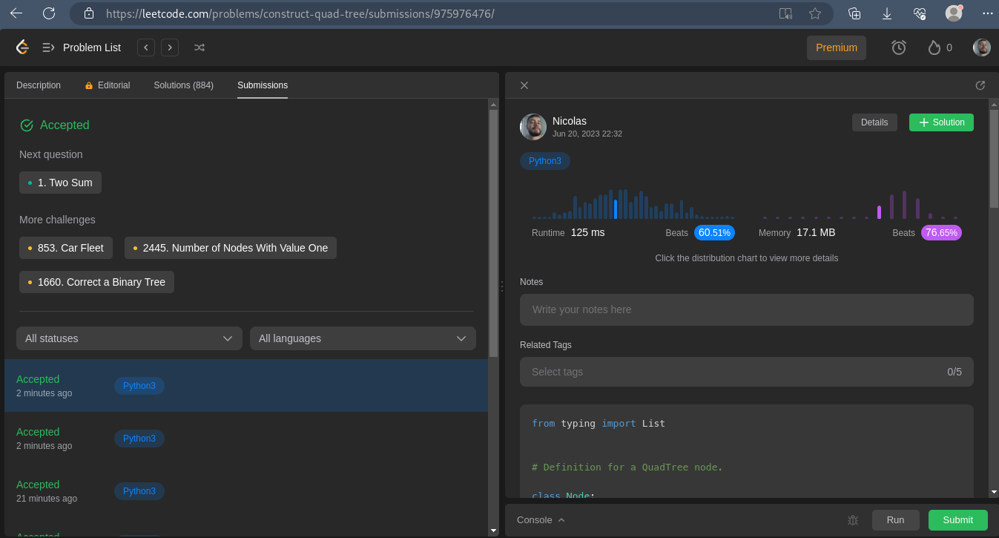

# Exercícios da Dupla 06

**Número da Lista**: 06<br/>
**Conteúdo da Disciplina**: Dividir e Conquistar<br/>

## Alunos

| Matrícula  | Aluno                                                                   |
|------------|-------------------------------------------------------------------------|
| 19/0112123 | [Lucas Gabriel Sousa Carmargo Paiva](https://github.com/lucasgabriel-2) |
| 20/0042327 | [Nicolas Chagas Souza](https://github.com/nszchagas)                    |

## Sobre

Nesse repositório estão os exercícios realizados durante o módulo.

## Screenshots

Resultado da submissão do exercício **Contagem de Interseções** ([CodeForces#101853](https://codeforces.com/gym/101853/problem/C))



Resultado da submissão do exercício **Inversões globais e locais** ([LeetCode#775](https://leetcode.com/problems/global-and-local-inversions/description/))



Resultado da submissão do exercício **Revertendo bits** ([LeetCode#190](https://leetcode.com/problems/reverse-bits/))



Resultado da submissão do exercício **Árvores Quaternárias** ([LeetCode#427](https://leetcode.com/problems/construct-quad-tree/description/))



## Instalação

**Linguagem**: C e Python<br/>
**Framework**: Não há<br/>

Para rodar os exercícios resolvidos em `c`, [count_intersections.c](./count_intersections.c), [inversao_global_e_local.c](./inversao_global_e_local.c) e [inverter_bits.c](./inverter_bits.c) é necessário compilar o arquivo utilizando o compilador da sua preferência e executar o arquivo gerado, com o gcc o comando é:

```shell
    gcc <nome_do_arquivo> [-o <nome_de_destino>] #Compilando o arquivo
    chmod u+x nome_de_destino #Passo opcional para usuários de linux, para tornar o arquivo executável.
    ./nome_de_destino #Executando o arquivo compilado.
```

> O parâmetro nome de destino é opcional, e caso não seja fornecido o arquivo terá o nome padrão a.out.

Para rodar o exercício resolvido em `python` [quad_tree.py](./quad_tree.py) é necessário ter Python3 instalado localmente, e então, executar o comando:

```shell
    python3 quad_tree.py
```

## Uso

Para testar as soluções basta submetê-las aos juízes virtuais, disponíveis nos links a seguir:

| Exercício                  | Código                                                   | Link |
| -------------------------- | -------------------------------------------------------- | ---- |
| Contagem de Interseções    | [count_intersections.c](./count_intersections.c)         |  [CodeForces#101853](https://codeforces.com/gym/101853/problem/C)    |
| Inversões globais e locais | [inversao_global_e_local.c](./inversao_global_e_local.c) |  [LeetCode#775](https://leetcode.com/problems/global-and-local-inversions/description/)    |
| Revertendo bits          | [inverter_bits.c](./inverter_bits.c)                     |  [LeetCode#190](https://leetcode.com/problems/reverse-bits/)    |
| Árvores Quaternárias       | [quad_tree.py](./quad_tree.py)                           |  [LeetCode#427](https://leetcode.com/problems/construct-quad-tree/description/)    |

## Outros

Quaisquer outras informações sobre seu projeto podem ser descritas abaixo.

Para auxiliar no desenvolvimento, alguns testes unitários foram criados, para rodar os testes é necessário ter o `pytest` instalado e então rodar `pytest quad_tree_test.py`.
